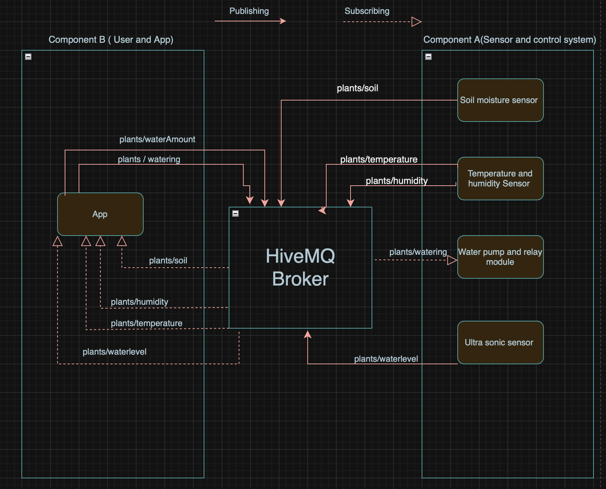

<!-- PROJECT TITLE -->
<br />
<div align="center">
<h3 align="center">plant_care_system</h3>

  <p align="center">
    The best app to monitor and control your plants every need.
    <br />
    <a href="https://git.chalmers.se/courses/dit113/2025/group-10/group10-plant-watering"><strong>Explore the docs »</strong></a>
  </p>
</div>


<!-- TABLE OF CONTENTS -->
<details>
  <summary>Table of Contents</summary>
  <ol>
    <li>
      <a href="#about-the-project">About The Project</a>
      <ul>
        <li><a href="#project-wiki">Project Wiki</a></li>
        <li><a href="#demo-video">Demo Video</a></li>
      </ul>
    </li>
    <li><a href="#software-architecture">Software Architecture</a></li>
    <li>
      <a href="#getting-started">Getting Started</a>
      <ul>
        <li><a href="#prerequisites">Prerequisites</a></li>
        <li><a href="#installation">Installation</a></li>
        <li><a href="#setup">Setup</a></li>
      </ul>
    </li>
    <li><a href="#usage">Usage</a></li>
    <li><a href="#roadmap">Roadmap</a></li>
    <li><a href="#contributions">Contributions</a></li>
  </ol>
</details>


<!-- ABOUT THE PROJECT -->
## About The Project

Plants liven up any space, and with this project we aim to make taking care of any plant much easier with simple mointoring and automatic watering to fufill your plants needs !


### Project Wiki
https://git.chalmers.se/courses/dit113/2025/group-10/group10-plant-watering/-/wikis/home

### Demo Video
https://www.youtube.com/watch?v=MPgn9T80wQg

## Software Architecture
The system uses a two-tier architecture, consisting of a user tier and a sensor tier. The tiers can communicate with each other using an MQTT client. Below is a diagram displaying the different tiers and their used topics.



<!-- GETTING STARTED -->
## Getting Started

To get a local copy up and running follow these simple steps. 

### Prerequisites

Things you need to use software and how to install them.

- Arduino IDE (optional)
https://support.arduino.cc/hc/en-us/articles/360019833020-Download-and-install-Arduino-IDE


* Android Studio
https://developer.android.com/studio


**Hardware:** 

* Microcontroller (e.g. WIO Terminal)
* Water pump + tube 
* Relay module
* Power supply
* Soil Moisture Level Sensor
* DHT11 Temperature/Humidity Sensor
* Ultrasonic Sensor
* Breadboard and connecting wires


### Installation

1. Clone the repo
   ```sh
   git clone https://git.chalmers.se/courses/dit113/2025/group-10/group10-plant-watering.git
   ```
2. Change git remote url to avoid accidental pushes to base project
   ```sh
   git remote set-url origin courses/dit113/2025/group-10/group10-plant-watering.git
   git remote -v # confirm the changes
   ```
3. Install Arduino CLI (if using CLI workflow):

Download from: https://arduino.github.io/arduino-cli

Or install via terminal:

macOS/Linux:
 ```sh
curl -fsSL https://raw.githubusercontent.com/arduino/arduino-cli/master/install.sh | sh
   ```
   
Windows (PowerShell):
 ```sh
iex "& { $(irm https://aka.ms/install-arduino-cli.ps1 -UseBasicP) }"
 ```

4. Install required libraries using Arduino CLI:

 ```sh
arduino-cli lib install "PubSubClient"
arduino-cli lib install "WiFiClientSecure" 
 ```

### Setup

**1. Connect the Soil Moisture Sensor:**

- Attach the sensor's VCC and GND to the microcontroller's 5V and GND pins.
- Connect the sensor's analog output (A2) to an analog input pin on the microcontroller.

**2. Set Up the Relay and Water Pump:**

- Connect the relay module to a digital output pin (A3) on the microcontroller.
- Wire the relay to control the water pump's power supply.
- Ensure the pump's power source matches its voltage requirements.

**3. Connect the Ultrasonic Sensor:**

- VCC to 5V
- GND to GND
- Connect the sensor's analog output (A7) to an analog input pin on the microcontroller.
- Mount the sensor at the top of the water reservoir, facing downward

**4. Connect the Temperature and Humidity Sensor:** 

- VCC to 5V
- GND to GND
- Data to a digital pin (D5)

**5. Position the Hardware:**

- Insert the soil moisture sensor into the plant's soil.
- Place the water pump in a water reservoir.
- Run tubing from the pump to the plant's base.

**6. Run Gradle:**

Windows:
 ```sh
gradlew build
gradlew run
 ```

macOS/Linux:
 ```sh
./gradlew build
./gradlew run
 ```

7. Software setup with Arduino CLI

- Install board platform (example: WIO):

 ```sh
arduino-cli core update-index
arduino-cli core install Seeeduino:samd

 ```
- Compile the sketch:

 ```sh
arduino-cli compile --fqbn Seeeduino:samd:seeed_wio_terminal path/to/project
 ```

- Upload to board:

 ```sh
arduino-cli upload -p <PORT> --fqbn Seeeduino:samd:seeed_wio_terminal path/to/project
 ```

- Monitor serial output:
 ```sh
arduino-cli monitor -p <PORT>
 ```

Replace <PORT> with your actual device port (e.g., COM3 on Windows or /dev/ttyUSB0 on macOS/Linux)

<!-- USAGE EXAMPLES -->
## Usage

Once your automatic plant watering system is set up and powered on, it will continuously monitor your plant's environment and water needs.

### How It Works

**Soil Moisture Monitoring:**
 The soil moisture sensor checks the moisture level of the soil. If it falls below the chosen threshold, the system activates the water pump to hydrate the plant and sends a notification that the moisture level is low. 

**Water Reservoir Level:** The ultrasonic sensor measures the water level in the reservoir. If the water level is too low, the system will alert you via a notification on the app to refill the reservoir.

**Temperature and Humidity Monitoring:** The DHT11 sensor monitors ambient temperature and humidity, and if either is out of a chosen range, the system will alert you via notification.

**Settings & Customization:** The app allows users to toggle on and off features (automatic watering and notifications) aswell as input desired ranges for moisture threshold, temperature humidity, and watering amount. Further, The app allows for scheduled watering to further customize watering to your plants needs.

**Care Suggestions:** The app includes preset "care suggestions" based on different ecosystems plants come from. Toggling one of the provided care suggestions, sets all settings to match that ecosystem. 

**Watering History (Logs):** The system provides logs of watering history that can be accessed at anytime to monitor and track watering history.

### Operating the System

**Power On:** Connect the microcontroller to a power source.

**Monitoring:** The system will automatically begin monitoring soil moisture, water reservoir level, and environmental conditions.

**Automatic Watering:** When the soil moisture drops below the set threshold and there's sufficient water in the reservoir, the pump will activate to water the plant.

**Alerts:** 
- If the water reservoir is low, the system will notify you to refill it. 
- If the moisture level goes below the threshold, the system will notify you to have the option to manual water the plant or use the "water" button that activates watering in the app. 
- If the temperature or humidity goes out of set range, the system will notify you of that as well. 


### Use Case
Imagine you're going on a two-week vacation. With this system in place, your plant will continue to receive water whenever the soil becomes too dry, ensuring it stays healthy in your absence. Additionally, by monitoring temperature and humidity, you can gain insights into the environmental conditions your plant experiences, allowing for better care and adjustments as needed.


<!-- ROADMAP -->
## Roadmap

- [x] Soil Moisture Detection and Display
- [x] Manual and Automatic Watering
    - [x] Notification when plant needs watering
    - [x] Automatic watering from app 
    - [x] Setting moisture Threshold for autmatic watering 
    - [x] Automatic watering when threshold is reached 
    - [x] Toggle automatic watering on/off
- [x] Water Reservoir Tracking 
    - [x] Notify when water level is low 
- [x] Temperature & Humidity Monitoring 
    - [x] Alert for temperature and humidity out of desired range 
- [x] Adjustable Settings
- [x] Care Suggestions 
- [x] Data logging / Watering history

See [requirements wiki page](https://git.chalmers.se/courses/dit113/2025/group-10/group10-plant-watering/-/wikis/Wiki) for more details on requirements


<!-- TEAM -->
## Contributions

Henning Nåbo: Structuring the app, restructuring the project, the CI/CD pipeline, scheduling of watering with time and date, icons and worked on the UI, video demo and bugfixes. 

Esther Valero: moisture threshold- setting and for automatic watering, the UI and Arduino elements for temperature and humidity, team organization/ updating plans, and writing the ReadMe

Leon Ljungström: created issues on git, arduino code for display, waterpump, soilsensor, relay module, mqtt integration, initial setup with libraries for wifi, mqtt etc.
mqtt integration, refactoring into fragments, initial UI setup with navigation, shared values across screens, logging watering, bug fixing.

Hasti Saei: set water amount, plants status, care suggestion, updating wiki, first component diagram, bug fixes and prototype .

Alva Svensson: Wiki- structure and content, notifications, notification when the plant is dry, ultrasonic sensor that notifies when the water level is low, and hardware setup (cardboard box)

To read detailed information on the Team organization see [team organization wiki page](https://git.chalmers.se/courses/dit113/2025/group-10/group10-plant-watering/-/wikis/Team-Organization)


